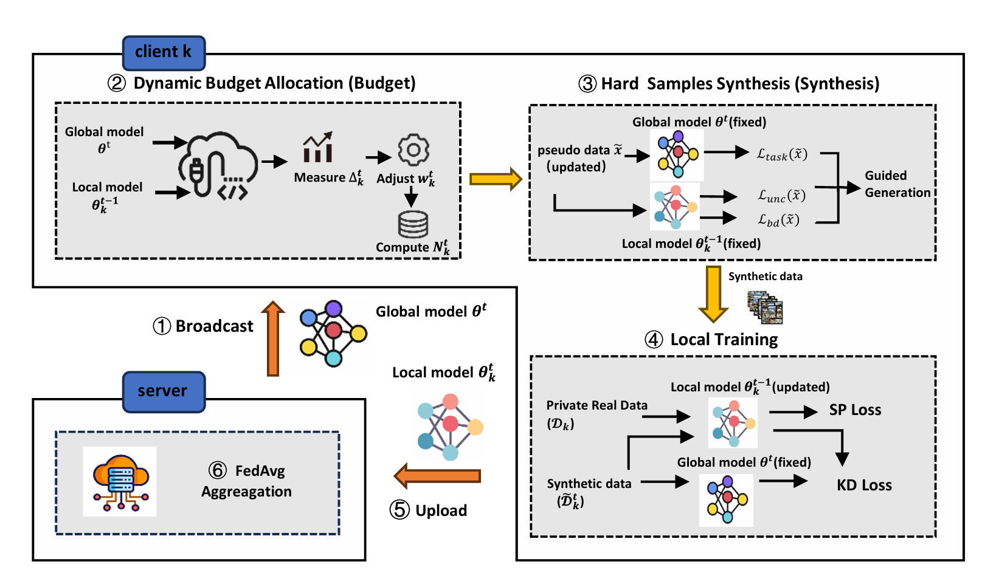

# FedHUG: Privacy-Preserving Federated Learning with Heterogeneity and Uncertainty-Guided Data Generation

**FedHUG**  is a privacy-preserving federated learning framework designed for Non-IID settings, where statistical heterogeneity often causes client drift, slows convergence, destabilizes training, and hurts generalization. 

The key idea is to generate informative synthetic samples locally (without requiring any public or shared proxy data) and use them for on-device knowledge distillation to align local updates with the global model. Rather than producing mostly easy, high-confidence samples, FedHUG explicitly targets high-uncertainty regions and areas near decision boundaries, where samples are more informative for correcting divergence between local and global decision boundaries. 

**FedHUG** consists of three main components:

1. Heterogeneity-aware dynamic budget allocation: each client measures drift by comparing its previous local model with the current global model, then scales its per-round generation budget so that clients with more severe drift receive more synthesis resources. 
2. Uncertainty- and boundary-guided hard sample synthesis: the global model acts as a fixed teacher to enforce semantic validity, while the client’s previous local model provides uncertainty (entropy) and boundary proximity (top-1/top-2 margin) signals to guide synthesis toward hard, informative samples. 
3. Local training with real supervision and generated-data distillation: clients optimize a mixed objective—supervised learning on private real data plus a KD loss on generated samples to align the local model with the global teacher—improving stability and reducing drift. 

For privacy, both generation and distillation happen entirely on-device. Clients only upload model parameters for aggregation and do not share real data, synthetic samples, or intermediate features. 




## Setup

Clone the repo and install the required packages.
```
git clone https://github.com/nie-xiaochen/FedHUG
cd FedHUG
conda create -n fedhug python=3.9.15
conda activate fedhug
pip install -r requirements.txt
```

## Training
The training script is in `run.sh`.

```
python -u fedhug.py --dataset fashionmnist --gpu 0 --partition noniid --beta 0.1   --model simplecnn-mnist --n_parties 10 --sample_fraction 1.0   --num_local_iterations 100 --start_round 50 --comm_round 70  --save_model   2>&1 | tee fedcog.log
```

```
python -u fedavg.py --dataset fashionmnist --gpu "0" --partition noniid  --model simplecnn-mnist --n_parties 10 --sample_fraction  1.0 --num_local_iterations 100 --beta 0.1 --comm_round 70 --save_model   2>&1 | tee fedavg.log
```

```
python -u fedavg.py --server_momentum 0.9 --dataset fashionmnist  --gpu "0" --partition noniid --model simplecnn-mnist --n_parties 10 --sample_fraction 1.0 --num_local_iterations 100 --beta 0.1 --comm_round 70 --save_model  2>&1 | tee fedavgm.log
```

```
python -u moon.py --mu 0.1 --dataset fashionmnist --gpu "0" --partition  noniid --model simplecnn-mnist --n_parties 10 --sample_fraction 1.0 --num_local_iterations 100 --beta 0.1 --comm_round 1 --save_model 2>&1 | tee moon.log
```

```
python -u fedprox.py --mu 0.01 --dataset fashionmnist --gpu "0" --partition noniid --model simplecnn-mnist --n_parties 10 --sample_fraction 1.0 --num_local_iterations 100 --beta 0.1 --comm_round 1 --save_model  2>&1 | tee fedprox.log
```

Key arguments:

- `dataset`: the name of dataset. We support 'cifar10', 'cifar100' and 'fashionmnist'. You may modify `cvdataset.py` if your interested dataset has not been supported.
- `gpu`: assign gpu here.
- `partition`: the data partitioning strategy, we support 'iid', 'noniid' and 'noniid-skew-2'
- `beta`: the parameter for the dirichlet distribution for data partitioning.
- `model`: neural network used in training. We support 'simplecnn' and 'simplecnn-mnist'.
- `n_parties`: the number of clients participated in federated learning.
- `sample_fraction`: the proportion of clients are sampled in each round.
- `num_local_iterations`: number of local iterations.
- `start_round`: the first round to implement generation for FedHUG.
- `comm_round`: the number of maximum communication round.
- `save_model`: the hyperparameter to decide whether to save the global model at the end.


